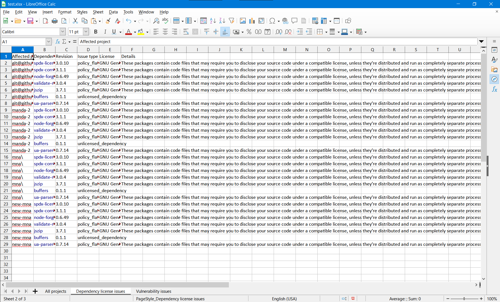
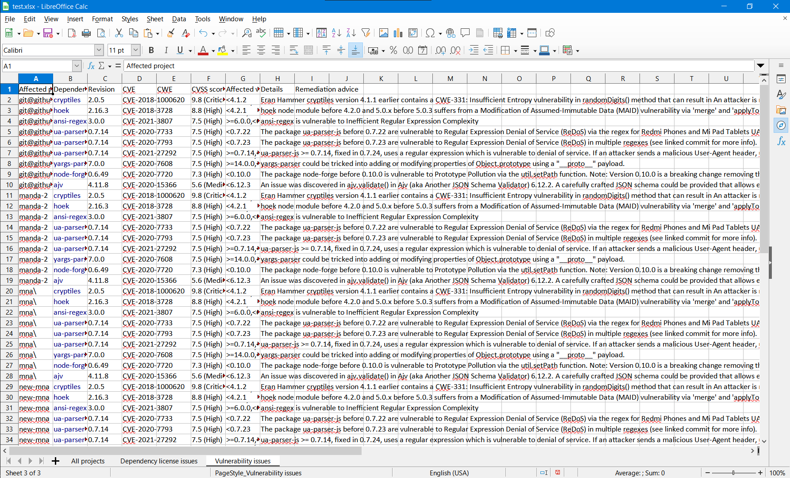

# manda

Tools to facilitate the creation of issue reports for customers going through mergers and acquisitions (M&As).

## Requirements

* Node.js (Tested on v14.18.1)

## Installation

```
git clone git@github.com:fossas/post_sales_scripts.git
cd post_sales_scripts/js/org-report
npm install
```

## Usage

Outputs a report in XLSX format. Will overwrite file without prompting if it already exists.

```bash
# report for all projects
FOSSA_API_TOKEN=your_api_token node index.js output_filename.xlsx

# report for a specific team
FOSSA_API_TOKEN=your_api_token node index.js --team=your_team_name_here output_filename.xlsx
```

Alternatively, you can create a file named `.env` and place your API token there; see [`.env.example`](./.env.example).

## Background

A FOSSA customer company in the process of acquiring another company wants to audit their intellectual property (IP, software in our case) to ensure it is legally sound and does not have security vulnerabilities. Since the target company knows best about their code and is likely not a FOSSA user, we need to guide them through integrating with FOSSA so the parent company can review their scan results.

Ideally we would be able to give the target limited access to the parent's FOSSA account, guide the target so they can upload the scans there, and all interested parties would be able to review the scan results and act accordingly. However this is not as easy as it seems and requires a lot of involvement from the target company, who probably doesn't care about using FOSSA.

The preferred way to share this information with customers is with a report that summarizes all the scanned projects and licensing/security issues detected in them. The FOSSA web UI is able to generate reports, but they are not granular or automated enough to select exactly the information relevant to companies involved in an M&A. This repository contains tools to help generate such reports.

## Glossary

* Parent company: the acquiring company
* Target company: the acquired company

## Screenshots



